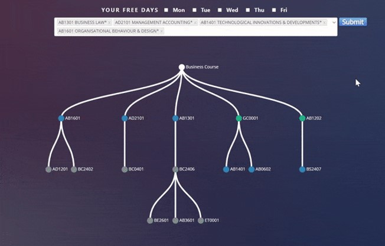
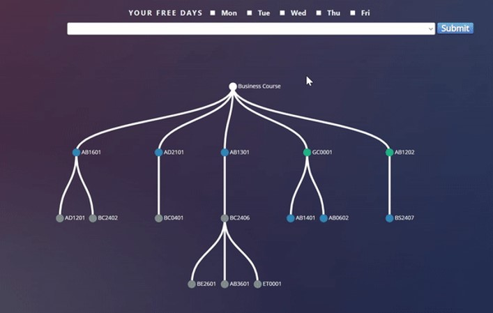
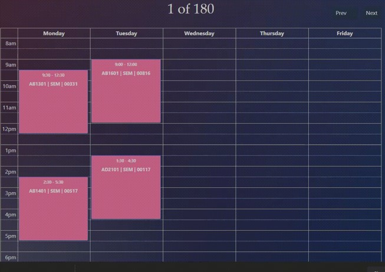
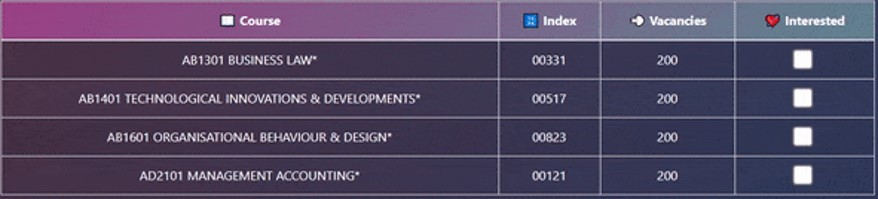

[![Contributors][contributors-shield]][contributors-url]
[![LinkedIn][linkedin-shield]][linkedin-url]

 

  
 
  <!-- TITLE -->
  <h1 align="center"><a href="https://whatstat-4a760.web.app/">⌛ NTU Timetable Planner ⌛</a></h1>
  

    For students, by students. Say bye to STARS Planner
     
     
     
    <a href="https://github.com/weilunn97/WhatStat/tree/master/src">Source Code</a>
    ·
    <a href="https://github.com/weilunn97/WhatStat/issues">Report Bug</a>
    ·
    <a href="https://github.com/weilunn97/WhatStat/issues">Request Feature</a>
  

<!-- TABLE OF CONTENTS -->
## 📃 Table of Contents 📃

* [About the Project ✏](#about-the-project)
* [Key Features ✨](#key-features)
* [Tech Stack 💻](#tech-stack)
* [Usage & Demo 📸](#usage-and-demo)
* [Contributing 🍻](#contributing)
* [License 📑](#license)
* [Contact 📞](#contact)
* [Acknowledgements 💳](#acknowledgements)
  

## ✏ About The Project ✏

Timetable planning at NTU is a hassle. Hence, we took some inspiration from <a href="https://nusmods.com/timetable/sem-1">NUSMods</a> to develop this specially for NTU students! 💕
  

## 💻 Tech Stack 💻
These are the key languages and frameworks which were used during the development of NTU Planner.

* Django
* HTML / CSS / JS

  

## 📸 Usage & Demo 📸

  
  **Timetable Planning** 
  

  **Graph Planning** 
   

  **Index Swapping** 
   

  **Expressing Interest** 
   

  

## 🍻 Contributing 🍻

Contributions are what make the open source community such an amazing place to be learn, inspire, and create. Any contributions you make are **greatly appreciated**.

1. Fork the Project
2. Create your Feature Branch (`git checkout -b feature/AmazingFeature`)
3. Commit your Changes (`git commit -m 'Add some AmazingFeature'`)
4. Push to the Branch (`git push origin feature/AmazingFeature`)
5. Open a Pull Request
  

<!-- LICENSE -->
## 📑 License 📑

Distributed under the MIT License. See `LICENSE` for more information.
  

## 📞 Contact 📞
📛 **Wei Lun**

🔗 [LinkedIn](https://www.linkedin.com/in/tan-wei-lun/)

📧 [Email](mailto:WTAN132@e.ntu.edu.sg)

🌐 [Website](https://weilunn97.wixsite.com/journeywithjed)

  

## 💳 Acknowledgements 💳
* [GitHub Emoji Cheat Sheet](https://www.webpagefx.com/tools/emoji-cheat-sheet)
* [GitHub Pages](https://pages.github.com)
* [MIT License](https://opensource.org/licenses/MIT)
* [Slick Carousel](https://kenwheeler.github.io/slick)
* [Smooth Scroll](https://github.com/cferdinandi/smooth-scroll)
  

<!-- MARKDOWN LINKS & IMAGES -->
<!-- https://www.markdownguide.org/basic-syntax/#reference-style-links -->
[contributors-shield]: https://img.shields.io/github/contributors/othneildrew/Best-README-Template.svg?style=flat-square
[contributors-url]: https://github.com/weilunn97/NTU-Timetable-Planner/graphs/contributors
[linkedin-shield]: https://img.shields.io/badge/-LinkedIn-black.svg?style=flat-square&logo=linkedin&colorB=555
[linkedin-url]: https://linkedin.com/in/tan-wei-lun
[product-screenshot]: images/screenshot.png
